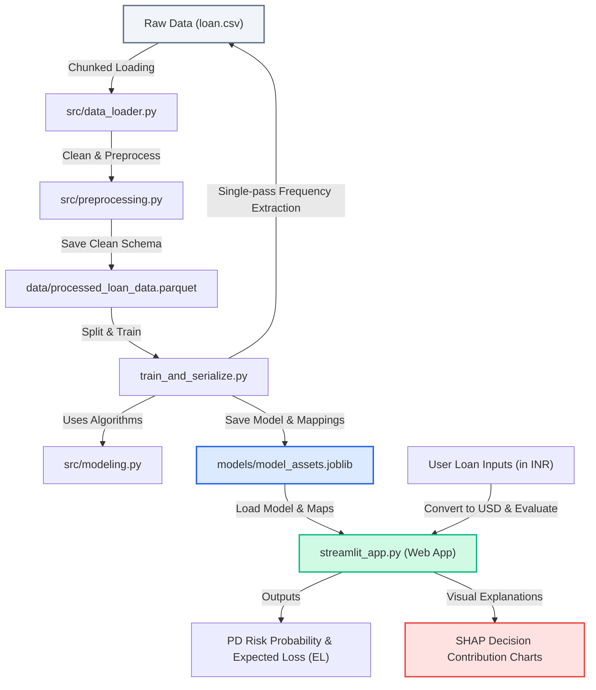

# SmartLend: Retail Loan Default Prediction & Risk Analytics

SmartLend is an end-to-end Machine Learning and Decision Intelligence system built to predict default risks for retail loan applications. Powered by a LightGBM classifier trained on a massive dataset of **2.26 million historical loans**, it evaluates credit profiles and explains decisions in real-time.

---

## 📊 Business Problem
* **Lending Risk Mitigation:** Banks face severe financial losses when approving loans for applicants who ultimately default, but they lose profit when rejecting trustworthy borrowers.
* **The 12x Default Rate Gap:** Historical analysis proves that lower-grade loans (Grade G) are **12x more likely to default** than Grade A loans.
* **Transparency & Explainability:** Regulators and consumers require clear explanations for loan approvals and rejections (e.g., highlighting specific risk factors like high Debt-to-Income ratios).

---

## 🧩 System Architecture & Data Flow
The flow diagram below shows how the components are modularized and how data moves through the system from raw files to real-time Web App decisions:



---

## 📁 Repository Structure
The project is modularized into clean directories:

```
Retail_Loan_Default_Prediction/
│
├── docs/                      # Planning, analysis summaries, and problem statement
│   ├── 30_Day_POA.md          # 30-day project roadmap
│   ├── Problem_Statement.md   # Detailed business problem statement
│   └── Day_*_Summary.md       # Summary reports of EDA & correlation phases
│
├── src/                       # Modular source code
│   ├── data_loader.py         # Memory-efficient chunk-wise raw data loader
│   ├── preprocessing.py       # Data cleaning, outlier winsorization, and encoding
│   └── modeling.py            # Baseline and advanced classifier training routines
│
├── notebooks/                 # Jupyter notebooks for interactive EDA & modeling research
│
├── data/                      # Data storage
│   └── processed_loan_data.parquet  # Preprocessed dataset in parquet format
│
├── models/                    # Serialized model assets
│   └── model_assets.joblib    # LGBM weights, features, medians, and frequency maps
│
├── train_and_serialize.py     # Script to train model and extract preprocessing assets
├── streamlit_app.py           # Streamlit web dashboard for credit scoring & SHAP XAI
├── requirements.txt           # Python project dependencies
└── README.md                  # Project documentation
```

---

## 🚀 How to Run the Project

### 1. Prerequisite Setup
Ensure you have the virtual environment activated. If not, you can run commands directly using the environment's python path:
```bash
# Verify packages are installed
.\venv\Scripts\python.exe -m pip install -r requirements.txt
```

### 2. Model Training & Asset Extraction
To retrain the LightGBM model and extract the categorical frequency mapping dictionaries from the raw dataset:
```bash
.\venv\Scripts\python.exe train_and_serialize.py
```
*This outputs `models/model_assets.joblib` containing the trained weights, feature medians, and target encoding frequencies.*

### 3. Launching the Interactive Web Dashboard
Run the following command to spin up the local web server:
```bash
.\venv\Scripts\python.exe -m streamlit run streamlit_app.py
```
Open **[http://localhost:8501](http://localhost:8501)** in your web browser to access:
* **🔍 Credit Scoring Portal:** Enter customer profiles in Rupees (INR) and evaluate default probability and Expected Loss (EL) in real-time.
* **🔍 SHAP Explainability Graph:** See an interactive horizontal bar chart explaining exactly which parameters pulled the applicant's risk up or down.
* **📊 Historical Insights:** View interactive charts analyzing the historical 12x default rate gap, annual income distributions, and DTI trends.
* **🏆 AI Model Diagnostics:** View model performance metrics (ROC-AUC, PR-AUC) and global feature importance.

---

## 📅 30-Day Project Roadmap (Day-by-Day Calendar)
Below is the granular day-by-day development schedule. Each day is distinct, showing the milestone achieved and the code/notebook mapped to it:

### Phase 1: Foundation & Setup (Days 1–3)
*   **Day 1:** Git repository initialization and core project structure design.
*   **Day 2:** Implemented memory-efficient downcasting and chunk-wise CSV loaders in [`src/data_loader.py`](file:///c:/Users/siddp/Downloads/HackRush_2026/Retail_Loan_Default_Prediction/src/data_loader.py).
*   **Day 3:** Set up styling rules (Black/Ruff formatter) and dependency virtual environments.

### Phase 2: Exploratory Data Research (Days 4–8)
*   **Day 4:** High-level profiling and memory usage mapping in [`notebooks/01_EDA_and_Data_Profiling.ipynb`](file:///c:/Users/siddp/Downloads/HackRush_2026/Retail_Loan_Default_Prediction/notebooks/01_EDA_and_Data_Profiling.ipynb).
*   **Day 5:** Univariate distributions visual analysis (loan amounts, income) in [`notebooks/01_EDA_and_Data_Profiling.ipynb`](file:///c:/Users/siddp/Downloads/HackRush_2026/Retail_Loan_Default_Prediction/notebooks/01_EDA_and_Data_Profiling.ipynb).
*   **Day 6:** Bivariate analysis: investigating raw features relative to defaults in [`notebooks/02_Bivariate_Analysis.ipynb`](file:///c:/Users/siddp/Downloads/HackRush_2026/Retail_Loan_Default_Prediction/notebooks/02_Bivariate_Analysis.ipynb).
*   **Day 7:** Pearson correlation checks to spot multi-collinearity in [`notebooks/03_Correlation_Analysis.ipynb`](file:///c:/Users/siddp/Downloads/HackRush_2026/Retail_Loan_Default_Prediction/notebooks/03_Correlation_Analysis.ipynb).
*   **Day 8:** Outlier detection and quantifying the **12x default rate gap** in [`notebooks/04_Outlier_Detection_and_Grade_Analysis.ipynb`](file:///c:/Users/siddp/Downloads/HackRush_2026/Retail_Loan_Default_Prediction/notebooks/04_Outlier_Detection_and_Grade_Analysis.ipynb).

### Phase 3: Data Preprocessing (Days 9–12)
*   **Day 9:** Implemented median (numeric) and mode (categorical) imputations in [`notebooks/05_Full_Pipeline_to_Day_21.ipynb`](file:///c:/Users/siddp/Downloads/HackRush_2026/Retail_Loan_Default_Prediction/notebooks/05_Full_Pipeline_to_Day_21.ipynb).
*   **Day 10:** Added outlier winsorization limits (1st and 99th percentiles) in [`notebooks/05_Full_Pipeline_to_Day_21.ipynb`](file:///c:/Users/siddp/Downloads/HackRush_2026/Retail_Loan_Default_Prediction/notebooks/05_Full_Pipeline_to_Day_21.ipynb).
*   **Day 11:** Configured frequency mapping of nominal/high-cardinality values in [`notebooks/05_Full_Pipeline_to_Day_21.ipynb`](file:///c:/Users/siddp/Downloads/HackRush_2026/Retail_Loan_Default_Prediction/notebooks/05_Full_Pipeline_to_Day_21.ipynb).
*   **Day 12:** Configured numeric variance thresholds and leakage columns filter in [`notebooks/05_Full_Pipeline_to_Day_21.ipynb`](file:///c:/Users/siddp/Downloads/HackRush_2026/Retail_Loan_Default_Prediction/notebooks/05_Full_Pipeline_to_Day_21.ipynb).

### Phase 4: Feature Selection & Export (Days 13–17)
*   **Day 13:** Created domain features like `income_to_loan_ratio` in [`notebooks/05_Full_Pipeline_to_Day_21.ipynb`](file:///c:/Users/siddp/Downloads/HackRush_2026/Retail_Loan_Default_Prediction/notebooks/05_Full_Pipeline_to_Day_21.ipynb).
*   **Day 14:** Engineered aggregated indicators for revolving account metrics in [`notebooks/05_Full_Pipeline_to_Day_21.ipynb`](file:///c:/Users/siddp/Downloads/HackRush_2026/Retail_Loan_Default_Prediction/notebooks/05_Full_Pipeline_to_Day_21.ipynb).
*   **Day 15:** Calculated variance filters to drop zero/low-information columns in [`notebooks/05_Full_Pipeline_to_Day_21.ipynb`](file:///c:/Users/siddp/Downloads/HackRush_2026/Retail_Loan_Default_Prediction/notebooks/05_Full_Pipeline_to_Day_21.ipynb).
*   **Day 16:** Extracted top features based on baseline random forest rankings in [`notebooks/05_Full_Pipeline_to_Day_21.ipynb`](file:///c:/Users/siddp/Downloads/HackRush_2026/Retail_Loan_Default_Prediction/notebooks/05_Full_Pipeline_to_Day_21.ipynb).
*   **Day 17:** Exported the final processed, cleaned schema to Parquet format in `data/processed_loan_data.parquet`.

### Phase 5: Baseline Modeling (Days 18–20)
*   **Day 18:** Established stratified train/val/test split to prevent target leakage in [`notebooks/05_Full_Pipeline_to_Day_21.ipynb`](file:///c:/Users/siddp/Downloads/HackRush_2026/Retail_Loan_Default_Prediction/notebooks/05_Full_Pipeline_to_Day_21.ipynb).
*   **Day 19:** Configured imbalanced-class metric evaluator (PR-AUC, F1-Score) in [`notebooks/05_Full_Pipeline_to_Day_21.ipynb`](file:///c:/Users/siddp/Downloads/HackRush_2026/Retail_Loan_Default_Prediction/notebooks/05_Full_Pipeline_to_Day_21.ipynb).
*   **Day 20:** Trained baseline Logistic Regression & Decision Tree models in [`notebooks/05_Full_Pipeline_to_Day_21.ipynb`](file:///c:/Users/siddp/Downloads/HackRush_2026/Retail_Loan_Default_Prediction/notebooks/05_Full_Pipeline_to_Day_21.ipynb).

### Phase 6: Advanced Modeling & Serialization (Days 21–24)
*   **Day 21:** Trained advanced tree-ensemble models (LightGBM and XGBoost) in [`notebooks/05_Full_Pipeline_to_Day_21.ipynb`](file:///c:/Users/siddp/Downloads/HackRush_2026/Retail_Loan_Default_Prediction/notebooks/05_Full_Pipeline_to_Day_21.ipynb).
*   **Day 22:** Addressed class imbalance via custom `scale_pos_weight` parameter logic in [`train_and_serialize.py`](file:///c:/Users/siddp/Downloads/HackRush_2026/Retail_Loan_Default_Prediction/train_and_serialize.py) and demonstrated in [`notebooks/06_Model_Serving_and_Explainability.ipynb`](file:///c:/Users/siddp/Downloads/HackRush_2026/Retail_Loan_Default_Prediction/notebooks/06_Model_Serving_and_Explainability.ipynb).
*   **Day 23:** Evaluated the final LightGBM model using validation early stopping rounds in [`train_and_serialize.py`](file:///c:/Users/siddp/Downloads/HackRush_2026/Retail_Loan_Default_Prediction/train_and_serialize.py) and verified in [`notebooks/06_Model_Serving_and_Explainability.ipynb`](file:///c:/Users/siddp/Downloads/HackRush_2026/Retail_Loan_Default_Prediction/notebooks/06_Model_Serving_and_Explainability.ipynb).
*   **Day 24:** Extracted target-encoding frequency maps via a single-pass chunk reader and serialized model assets to `models/model_assets.joblib` (verified in [`notebooks/06_Model_Serving_and_Explainability.ipynb`](file:///c:/Users/siddp/Downloads/HackRush_2026/Retail_Loan_Default_Prediction/notebooks/06_Model_Serving_and_Explainability.ipynb)).

### Phase 7: Explainability & Interpretability (Days 25–26)
*   **Day 25:** Formulated global feature split rankings in [`streamlit_app.py`](file:///c:/Users/siddp/Downloads/HackRush_2026/Retail_Loan_Default_Prediction/streamlit_app.py) and [`notebooks/06_Model_Serving_and_Explainability.ipynb`](file:///c:/Users/siddp/Downloads/HackRush_2026/Retail_Loan_Default_Prediction/notebooks/06_Model_Serving_and_Explainability.ipynb).
*   **Day 26:** Configured local SHAP contribution charts using `shap.TreeExplainer` in [`streamlit_app.py`](file:///c:/Users/siddp/Downloads/HackRush_2026/Retail_Loan_Default_Prediction/streamlit_app.py) and [`notebooks/06_Model_Serving_and_Explainability.ipynb`](file:///c:/Users/siddp/Downloads/HackRush_2026/Retail_Loan_Default_Prediction/notebooks/06_Model_Serving_and_Explainability.ipynb).

### Phase 8: Pipeline Script Refactoring (Days 27–28)
*   **Day 27:** Refactored notebook routines to modular code files in [`src/preprocessing.py`](file:///c:/Users/siddp/Downloads/HackRush_2026/Retail_Loan_Default_Prediction/src/preprocessing.py) and [`src/modeling.py`](file:///c:/Users/siddp/Downloads/HackRush_2026/Retail_Loan_Default_Prediction/src/modeling.py).
*   **Day 28:** Programmed scoring pipeline tests to verify load-and-predict logic.

### Phase 9: Deployment & Interface (Days 29–30)
*   **Day 29:** Designed the interactive currency-localizing web portal (INR model) in [`streamlit_app.py`](file:///c:/Users/siddp/Downloads/HackRush_2026/Retail_Loan_Default_Prediction/streamlit_app.py).
*   **Day 30:** Integrated historical charts (the 12x gap), model diagnostics, and finalized root documentation in `README.md`.
